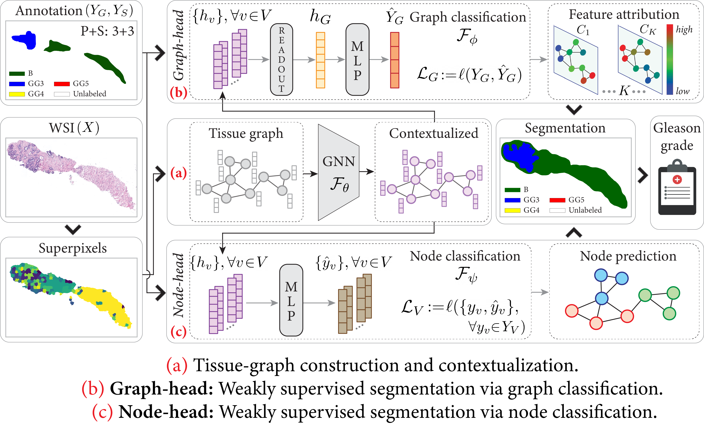
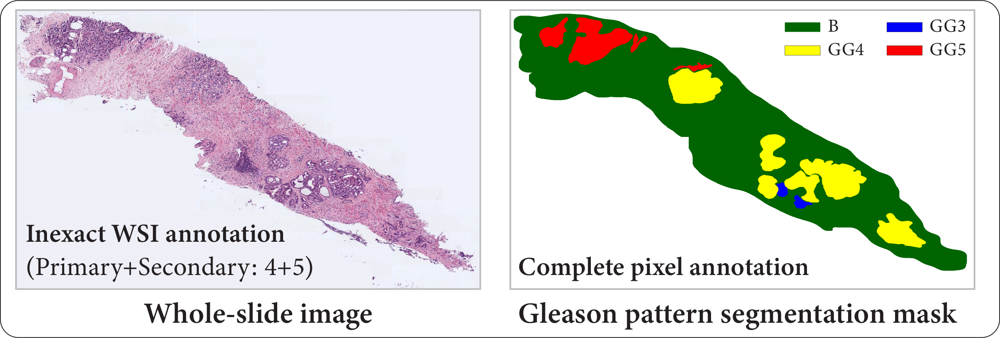

# SegGini: 
### SEGmentation using Graphs with Inexact aNd Incomplete labels 

This repository contains the code to reproduce the results of ["Learning Whole-Slide Segmentation from Inexact and Incomplete Labels using Tissue Graphs"](https://arxiv.org/pdf/2103.03129.pdf), MICCAI, 2021. 

The code is built on the [`Histocartography`](https://github.com/histocartography/histocartography) library, a python-based package that facilitates the modelling and learning of pathology images as graphs. 

The described experiments are presented for the [`SICAPv2`](https://data.mendeley.com/datasets/9xxm58dvs3/1) dataset, a cohort of Hematoxylin and Eosin (H&amp;E) stained prostate needle biopsies. 

### Overview


## Installation 

### Cloning and handling dependencies 

Clone the repo:

```
git clone git@github.com:histocartography/seg-gini.git && cd seg-gini
```

Create a conda environment and activate it:

```
conda env create -f environment.yml
conda activate seggini
```

### Downloading and preparing the SICAPv2 dataset 

[`SICAPv2`](https://data.mendeley.com/datasets/9xxm58dvs3/1) is a database of H&amp;&E stained patches (512x512 pixels) from 155 prostate whole-slide images (WSIs) across 95 patients. The dataset contains local patch-level segmentation masks for Gleason patterns (Non-cancerous, Grade3, Grade4, Grade5) and global Gleason scores (Primary + Secondary).  

The SICAPv2 dataset downloading, the construction of WSIs, and the slide-level Gleason pattern segmentation masks can be created by running:

```
cd bin
python create_sicap_data.py --base_path <PATH-TO-STORE-DATASET>
```

A sample WSI and corresponding segmentation mask is demonstrated as follows. To highlight, the available Gleason score is inexact as it only states the worst and the second worst Gleason pattern present in the WSI. 


  

## Running the code 

SegGini aims to leverage the WSI-level inexact supervision and incomplete pixel-level annotations for semantically segmenting the Gleason patterns in the WSI. To this end, first it translates a WSI into a `Tissue-graph` representation, and then employs Graph Neural Network based `Graph-head` and `Node-head`.


### Step 1: Tissue-graph representation 

The WSI to Tissue-graph transformation can be generated by running: 

```
cd bin
python preprocess.py --base_path <PATH-TO-STORED-DATASET>
```

The script creates three directories with the following content per WSI:
- a tissue graph as a `.bin` file
- a superpixel map as a `.h5` file
- a tissue mask as a `.png` file

Here, we also parse the available image and pixel annotations to create the necessary pickle files, to be used during `training` phase.

Finally, the directories should look like:

```
SICAPv2-data
|
|__ preprocess
|   |
|   |__ graphs
|   |
|   |__ superpixels 
|   |
|   |__ tissue_masks 
|
|__ pickles
    |
    |_ images.pickle
    |
    |_ annotation_masks_100.pickle 
    |
    |_ image_level_annotations.pickle

```


### Step 2: Training + Testing SegGini 

We provide the option to train `SegGini` for three types of annotations. 
1. **Inexact**image-level annotations
2. **Incomplete**pixel-level annotations
3. **Inexact**and**Incomplete**annotations


Training `SegGini` for `Inexact` annotations:

```
python train_graph.py --base_path <PATH-TO-STORED-DATASET> --config <PATH-TO-TRAINING-CONFIGURATION-YAML-FILE> 
```

Training `SegGini` for `Incomplete` annotations:

```
python train_node.py --base_path <PATH-TO-STORED-DATASET> --config <PATH-TO-TRAINING-CONFIGURATION-YAML-FILE> 
```

Training `SegGini` for `Inexact + Incomplete` annotations:

```
python train_combined.py --base_path <PATH-TO-STORED-DATASET> --config <PATH-TO-TRAINING-CONFIGURATION-YAML-FILE> 
```

Sample configuration yaml files for all the above cases are provided in `./config`


### Cite

If you use this code, please consider citing our work:

```
@inproceedings{anklin2021,
    title = "Learning Whole-Slide Segmentation from Inexact and Incomplete Labels using Tissue Graphs",
    author = "Valentin Anklin, Pushpak Pati, Guillaume Jaume, Behzad Bozorgtabar, Antonio Foncubierta-Rodriguez, Jean-Philippe Thiran, Mathilde Sibony, Maria Gabrani and Orcun Goksel",
    booktitle = "Medical Image Computing and Computer-Assisted Intervention (MICCAI)",
    pages = "636-646",
    year = "2021"
} 
```

